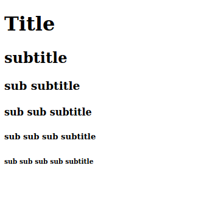
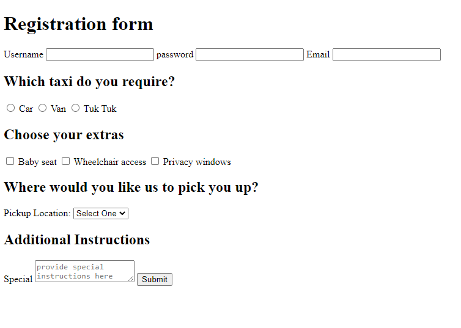

# 1.1 - HTML Workshop

## 🦉 Lecture

Throughout the bootcamp, you will always be provided with the slides prior to the day's lecture/workshop and are welcome to go over the content _after doing the pre-lecture work._ Today's lecture/workshop doesn't have any pre-lecture work to do.

[m1_d1.pdf](__lecture/m1_d1.pdf)

_If you want to view pdf files directly in VS Code, install the following extension: [vscode-pdf](https://marketplace.visualstudio.com/items?itemName=tomoki1207.pdf)._

---

## ⚡ Exercises

Before you dive into the workshop, be sure to have read the provided [HTML-reference doc](__1-lecture/HTML-reference.md).

When creating HTML files, be sure to use proper formatting. Here is a basic template.

_Don't worry about styling and alignment at this point, we'll get to that when we add CSS._

```html
<!DOCTYPE html>
<html>
  <body>
    ...
  </body>
</html>
```

### Exercise 1

_Questions located in the `__2-workshop/exercise-1` folder_

---

### Exercise 2

1. Open the provided `index.html` file in the browser.
2. Modify it to match the following image


---

### Exercise 3

Write an HTML page that matches the screenshot provided.



---

### Exercise 4

Write an HTML page that matches the following:


If you did not find the previous exercise easy, start from scratch.

---

### Exercise 5

Update the HTML code to match the following:


TIOBE Index link: https://www.tiobe.com/tiobe-index/

Use `target="_blank"` on the `<a>` tag to open the link in a new tab

---

### Exercise 6

Fix the HTML code so it renders correctly:


---

### Exercise 7

Create an HTML file so it matches the screenshot provided:


Hint: use the `<table>` element

Use `target="_blank"` on the `<a>` tags to open the links in a new tab

Links

- https://en.wikipedia.org/wiki/Canada
- https://en.wikipedia.org/wiki/United_States
- https://en.wikipedia.org/wiki/China
- https://en.wikipedia.org/wiki/Japan

---

<center>🟡 - Minimally complete workshop (75%) - 🟡</center>

---

### Exercise 8

Update the HTML file so it matches the provided image:



#### Hints

- Use the `<form>` element
- Use the `<label>` tag to make the text describing inputs clickable
- Make all input elements before the **Extras** section required with the required attribute
- `<input type="text" required />`
- Use the `<select>` tag for the pickup list
- Try to make sure your form is accessibility-friendly.

---

<center>🟢 - Complete workshop (100%) - 🟢</center>

---
