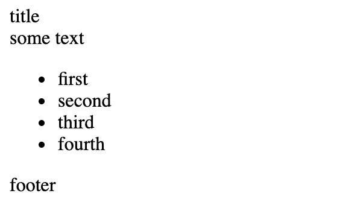

# 1.1 - HTML Workshop

Before you dive into the workshop, be sure to have read the provided HTML-reference doc.

When creating HTML files, be sure to use proper formating. Here is a basic template.

_Don't worry about styling and alignment at this point, we'll worry about that when we add CSS._

```html
<!DOCTYPE html>
<html>
  <body>
    ...
  </body>
</html>
```

## Exercise 1

_Questions located in the exercise folder_

## Exercise 2

1. Open the provided `index.html` file in the browser.
2. Modify it to match the following image



## Exercise 3

Write an HTML page that matches the screenshot provided.


Your file should have this structure:

## Exercise 4

Write an HTML page that matches the following:


If you did not find the previous exercise easy, start from scratch.

## Exercise 5

Update the HTML code to match the following:


TIOBE Index link: https://www.tiobe.com/tiobe-index/

Use `target="_blank"` on the `<a>` tag to open the link in a new tab

## Exercise 6

Fix the HTML code so it renders correctly:


## Exercise 7

Create an HTML file so it matches the screenshot provided:


Hint: use the `<table>` element

Use `target="_blank"` on the `<a>` tags to open the links in a new tab

Links

- https://en.wikipedia.org/wiki/Canada
- https://en.wikipedia.org/wiki/United_States
- https://en.wikipedia.org/wiki/China
- https://en.wikipedia.org/wiki/Japan

---

<center>🟡 - Minimally complete workshop (75%) - 🟡</center>

---

## Exercise 8

Update the HTML file so it matches the provided image:


### Hints

- Use the `<form>` element
- Use the `<label>` tag to make the text describing inputs clickable
- Make all input elements before the **Extras** section required with the required attribute
- `<input type="text" required />`
- Use the `<select>` tag for the pickup list
- Try to make sure your form is accessibility-friendly.

---

<center>🟢 - Complete workshop (100%) - 🟢</center>

---
